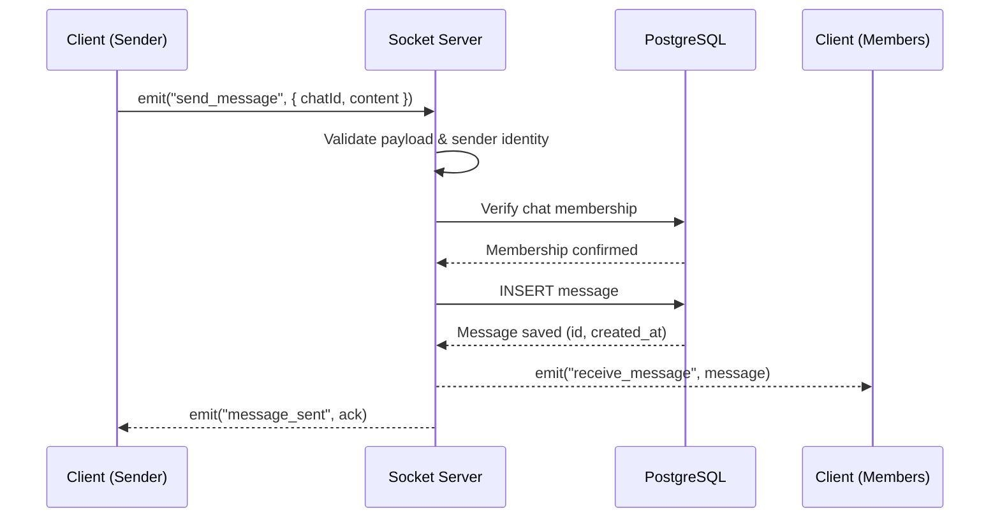
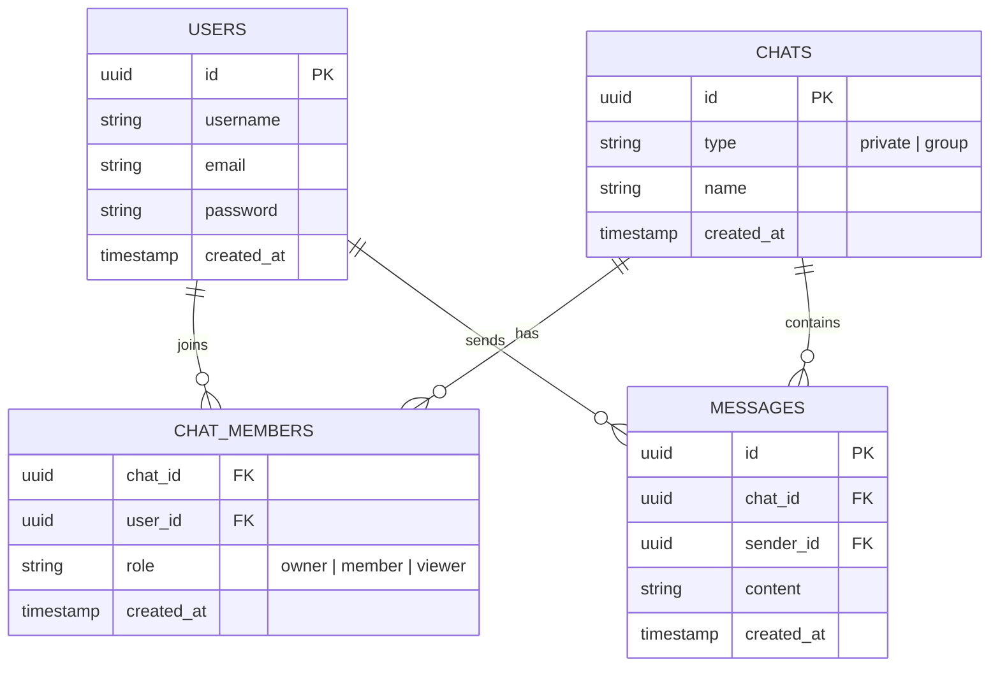
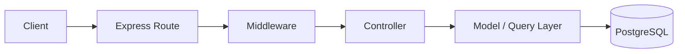
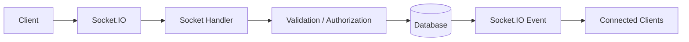
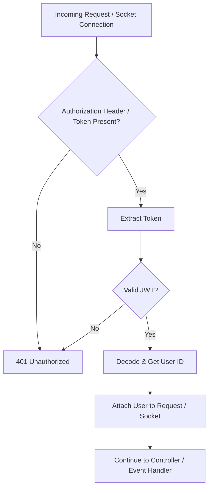
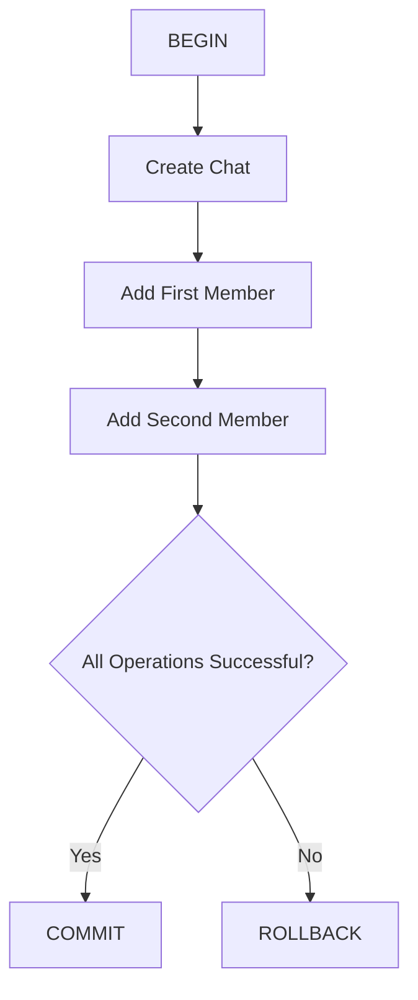
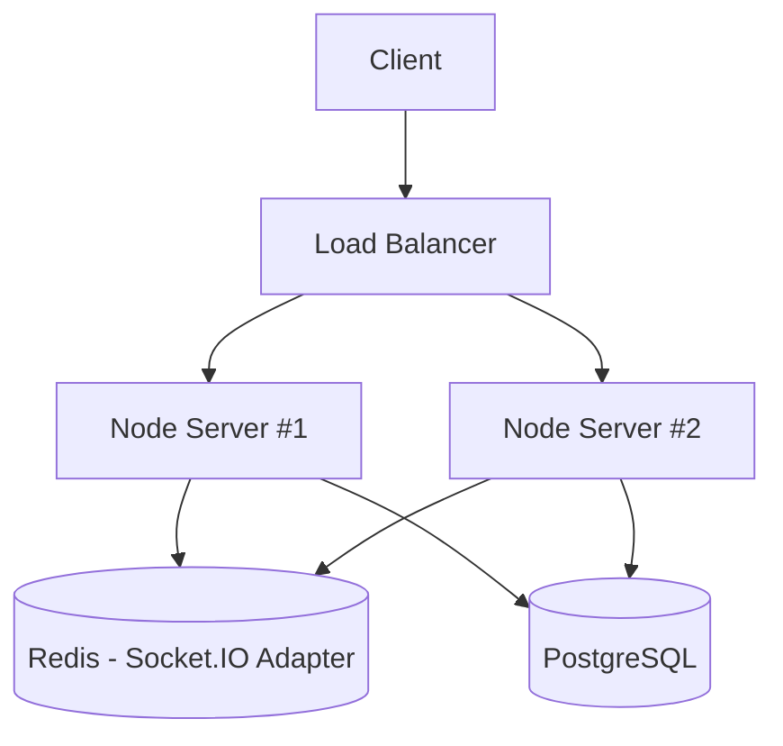

<div align="center">
  <h1>💬 Real-Time Chat Backend API</h1>
  <p>
    A robust, scalable backend architecture for real-time messaging applications.
  </p>

  
  
  
  
  

  <br/>

  
  
</div>

---

## 📖 Table of Contents

* [📝 Project Description](#-project-description)
* [✨ Features](#-features)
* [🛠 Tech Stack](#-tech-stack)
* [📂 Project Structure](#-project-structure)
* [🚀 Installation & Setup](#-installation--setup)
* [🔐 Environment Variables](#-environment-variables)
* [📡 REST API Documentation](#-rest-api-documentation)
* [⚡ Real-Time Events](#-real-time-events-socketio)
* [🔄 Message Flow](#-message-flow)
* [🗄 Database Schema](#-database-schema)
* [🏗 Architecture & Error Handling](#-architecture--error-handling)
* [🔒 Authentication Flow](#-authentication-flow)
* [🔁 PostgreSQL Transactions](#-postgresql-transactions)
* [📊 Scalability Considerations](#-scalability-considerations)
* [🚀 Future Improvements](#-future-improvements)
* [👨‍💻 Author](#-author)

---

## 📝 Project Description

This repository contains the backend for a **Real-Time Chat Application** built with **Node.js, Express.js, TypeScript, Socket.IO, and PostgreSQL**.

The application is designed to provide reliable, instant communication between users through bidirectional, event-driven connections.

Unlike traditional HTTP polling — where clients repeatedly ask the server for new data — Socket.IO allows the server to **push events to connected clients the moment they happen**.

The backend also exposes RESTful APIs for authentication, user management, chat management, and retrieving persistent message history.

---

## ✨ Features

* 🔴 **Real-Time Messaging** via Socket.IO
* 🔑 **Authentication & Authorization** using JWT
* 👤 **Private Chats** for one-to-one conversations
* 👥 **Group Chats** with multiple members
* 🛡 **Role-Based Chat Membership Management**
* 💾 **Persistent Message History** stored in PostgreSQL
* 📡 **RESTful APIs** for users and chats
* ⚠️ **Centralized Error Handling** for consistent API responses
* ⏳ **Async Error Handling** for both Express and Socket.IO handlers
* 🔄 **PostgreSQL Transactions** for data consistency
* 🆔 **UUID-based Identifiers** for users, chats, and messages
* ⚙️ **Environment-based Configuration** using dotenv

---

## 🛠 Tech Stack

### Backend

| Layer | Technology |
|---|---|
| Runtime | Node.js |
| Framework | Express.js |
| Language | TypeScript |
| Real-Time Communication | Socket.IO |
| Database | PostgreSQL |
| Database Driver | `pg` |
| Authentication | JWT |
| Password Hashing | bcrypt |

### Development & Utilities

* dotenv
* CORS
* express-validator
* npm
* Git & GitHub

---

## 📂 Project Structure

```text
Real-time-chat/
├── src/
│   ├── config/
│   │   └── database.ts
│   │
│   ├── controllers/
│   │
│   ├── models/
│   │
│   ├── routes/
│   │
│   ├── middleware/
│   │
│   ├── sockets/
│   │
│   ├── utils/
│   │
│   ├── types/
│   │
│   ├── app.ts
│   └── server.ts
│
├── .env.example
├── package.json
├── tsconfig.json
└── README.md
```

> ℹ️ The exact structure may vary slightly depending on the current implementation.

---

## 🚀 Installation & Setup

### Prerequisites

Make sure you have the following installed:

* Node.js 18+
* PostgreSQL
* npm
* Git

### 1. Clone the repository

```bash
git clone https://github.com/ahmed12334567/Real-time-chat.git
cd Real-time-chat
```

### 2. Install dependencies

```bash
npm install
```

### 3. Configure environment variables

Create a `.env` file in the project root:

```bash
cp .env.example .env
```

Then update the values according to your local PostgreSQL configuration.

### 4. Start the development server

```bash
npm run dev
```

The server should now be available at:

```text
http://localhost:3000
```

---

## 🔐 Environment Variables

Example `.env` configuration:

```env
# Server
PORT=3000
NODE_ENV=development

# PostgreSQL
DB_HOST=localhost
DB_PORT=5432
DB_USER=postgres
DB_PASSWORD=your_password
DB_NAME=chat_db

# Authentication
JWT_SECRET=your_jwt_secret
JWT_EXPIRES_IN=7d
```

> ⚠️ Never commit your real `.env` file or expose your JWT secret publicly.

---

## 📡 REST API Documentation

The backend exposes RESTful endpoints for authentication, users, chats, and messages.

### Authentication

| Method | Endpoint | Description | Auth |
|---|---|---|---|
| `POST` | `/auth/register` | Register a new user | No |
| `POST` | `/auth/login` | Login and receive authentication tokens | No |
| `POST` | `/auth/refresh` | Generate a new access token | No / Refresh Token |

### Chats

| Method | Endpoint | Description | Auth |
|---|---|---|---|
| `GET` | `/chats` | Get user's chats | Yes |
| `POST` | `/chats/private` | Create a private chat | Yes |
| `GET` | `/chats/:chatId` | Get chat information | Yes |
| `GET` | `/chats/:chatId/messages` | Get chat message history | Yes |

### Chat Members

| Method | Endpoint | Description | Auth |
|---|---|---|---|
| `POST` | `/chats/:chatId/members` | Add a member to a chat | Yes |
| `DELETE` | `/chats/:chatId/members/:memberId` | Remove a member | Yes |
| `PATCH` | `/chats/:chatId/members/:memberId` | Update member role | Yes |

> ℹ️ Update the endpoint names above to match the exact routes implemented in the project.

---

## ⚡ Real-Time Events (Socket.IO)

Socket.IO handles real-time, bidirectional communication between connected clients and the server.

### Chat Events

| Event | Direction | Purpose |
|---|---|---|
| `connection` | Client → Server | Establish Socket.IO connection |
| `join_chat` | Client → Server | Join a chat room |
| `send_message` | Client → Server | Send a new message |
| `receive_message` | Server → Client | Deliver a new message |
| `typing` / `stop_typing` | Client → Server | Broadcast typing status |
| `mark_as_read` | Client → Server | Mark messages as read |
| `update_message` | Client → Server | Edit an existing message |
| `delete_message` | Client → Server | Delete a message |
| `add_member` | Client → Server | Add a member to a chat |
| `disconnect` | Client → Server | Handle socket disconnection |

### Example: Send Message

**Client:**

```javascript
socket.emit("send_message", {
  chatId: "chat-uuid",
  content: "Hello!",
});
```

**Server:**

```javascript
socket.on("receive_message", (message) => {
  console.log(message);
});
```

---

## 🔄 Message Flow

The diagram below shows the end-to-end lifecycle of a single message, from the moment a client emits it to the moment other members receive it.



---

## 🗄 Database Schema

The application uses PostgreSQL to persist users, chats, members, and messages.



**Relationship summary:**

* A user can belong to many chats.
* A chat can contain many users.
* A chat can contain many messages.
* Each message belongs to one chat and is sent by one user.

---

## 🏗 Architecture & Error Handling

The project follows a layered backend architecture designed to separate responsibilities and keep the code maintainable.

### Request Flow (REST)



### Request Flow (Real-Time)



### Centralized Error Handling

All application errors flow through centralized error middleware, producing a consistent response shape:

```json
{
  "success": false,
  "error": "Message Not Found",
  "statusCode": 404
}
```

### Async Error Handling

Asynchronous operations are wrapped with handlers that forward rejected promises to the centralized error handler — preventing unhandled promise rejections in both Express routes and Socket.IO handlers.

---

## 🔒 Authentication Flow

Protected HTTP routes verify the JWT before allowing the request to continue. Socket connections go through the same verification before being allowed to join rooms or emit events.



---

## 🔁 PostgreSQL Transactions

Transactions are used whenever multiple database operations must succeed or fail together — for example, creating a chat and adding its initial members.



This preserves the core **ACID** guarantees:

* **Atomicity** — all operations succeed, or none are applied.
* **Consistency** — database constraints remain valid.
* **Isolation** — concurrent transactions don't interfere with one another.
* **Durability** — once committed, changes are permanently persisted.

---

## 📊 Scalability Considerations

The architecture can be extended to support larger numbers of concurrent users by scaling Node.js horizontally and synchronizing Socket.IO events across instances with a Redis adapter.



Redis synchronizes Socket.IO events across multiple Node.js instances, so a message emitted on one server is correctly delivered to clients connected to another.

---

## 🚀 Future Improvements

* [x] Typing indicators
* [x] Read receipts
* [ ] Online / Offline presence
* [x] Message editing
* [x] Message deletion
* [ ] File and image uploads
* [ ] Push notifications
* [ ] Message pagination / cursor-based pagination
* [ ] Redis adapter for Socket.IO scaling
* [ ] Horizontal server scaling
* [ ] End-to-End Encryption
* [ ] Automated tests
* [ ] API documentation with Swagger/OpenAPI
* [ ] Docker support

---

## 👨‍💻 Author

**Ahmed Abdulrahman**

Backend Developer focused on **Node.js, TypeScript, PostgreSQL, REST APIs, and Real-Time Applications**.

* GitHub: [@ahmed12334567](https://github.com/ahmed12334567)
* Repository: [Real-time-chat](https://github.com/ahmed12334567/Real-time-chat)

---

## ⭐ Support

If you find this project useful, consider giving the repository a ⭐ on GitHub.

---

## 📄 License

This project is intended for educational and development purposes.
